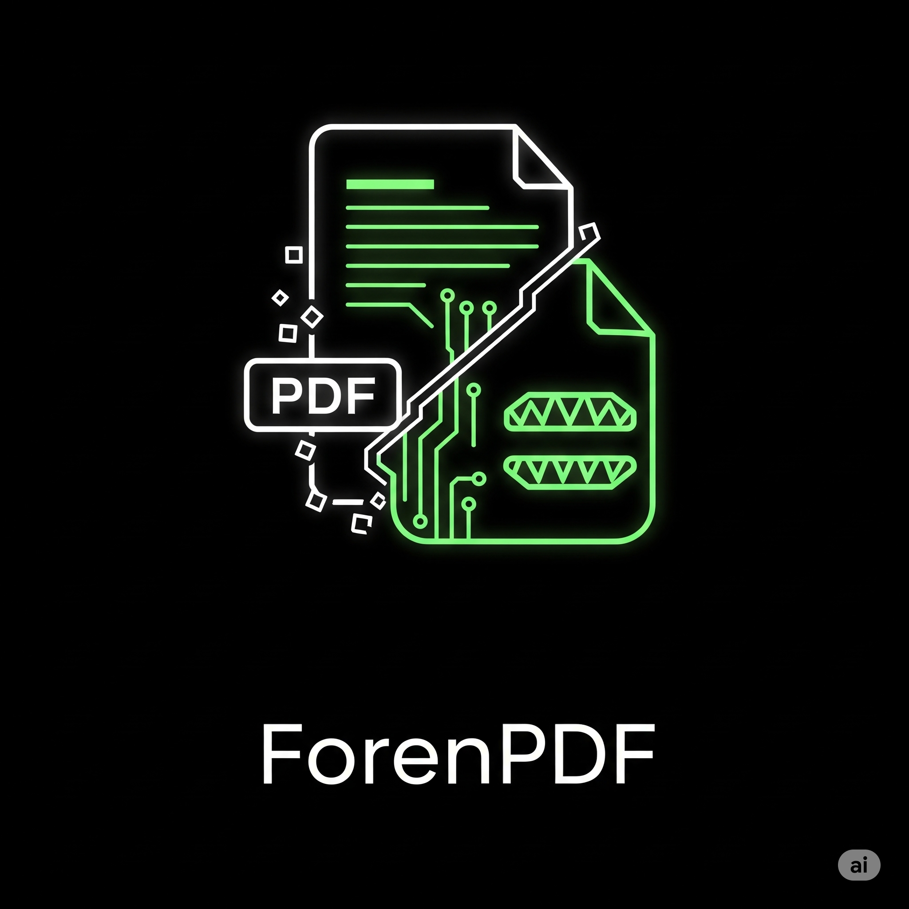

<h1 align="center">ForenPDF</h1>

<p align="center">
  
</p>

## PDF Forensic Data Extractor

Uma ferramenta Python para coleta forense de metadados, conteúdo de texto, imagens, links e informações estruturadas de arquivos PDF, com geração de hashes de integridade e informações do sistema de arquivos.


## 📑 Sumário

- [PDF Forensic Data Extractor](#pdf-forensic-data-extractor)
- [📑 Sumário](#-sumário)
- [📌 Descrição](#-descrição)
- [📦 Dependências](#-dependências)
  - [Instalação](#instalação)
- [🛠️ Como Usar](#️-como-usar)
- [📋 Relatório Gerado](#-relatório-gerado)
- [📁 Estrutura de Saída](#-estrutura-de-saída)
- [📊 Exemplo de Uso](#-exemplo-de-uso)
- [⚠️ Avisos e Boas Práticas](#️-avisos-e-boas-práticas)
- [📚 Referências Técnicas](#-referências-técnicas)
- [📖 Licença](#-licença)
- [👨‍💻 Autor](#-autor)

## 📌 Descrição

Esta ferramenta realiza extração completa de informações de arquivos PDF para fins de análise forense ou investigação digital, incluindo:

- Metadados do documento.
- Versão do PDF declarada no cabeçalho.
- Hashes criptográficos (MD5, SHA1, SHA256) para validação de integridade.
- Tamanhos e datas de criação/modificação do arquivo.
- Conteúdo de texto por página.
- Imagens embutidas extraídas para arquivos.
- Links identificados por página.
- Estrutura de objetos internos do PDF.
- Blocos e palavras do texto.
- Metadados XMP (se existentes).
- Geração de um relatório estruturado em `.txt`.

## 📦 Dependências

- Python 3.8+
- [PyMuPDF (fitz)](https://pypi.org/project/PyMuPDF/)
- hashlib (embutido)
- datetime (embutido)
- os (embutido)

### Instalação

```bash
pip install PyMuPDF
```

## 🛠️ Como Usar

Execute o script pelo terminal ou CMD:

```bash
python save-data.py
```

Informe o caminho completo e o nome do arquivo PDF quando solicitado:

```
📄 Enter the full path and filename of the PDF to process: A:/caminho/arquivo.pdf
```

## 📋 Relatório Gerado

Será criado um arquivo `.txt` no mesmo diretório contendo:

- 📄 **Informações forenses do arquivo**
- 🔐 **Hashes criptográficos**
- 📄 **Metadados do PDF**
- 📄 **Versão do PDF**
- 📦 **Objetos internos do PDF**
- 📖 **Conteúdo de texto por página**
- 🖼️ **Imagens embutidas**
- 🔗 **Links por página**
- 📦 **Text Blocks**
- 📝 **Palavras identificadas**
- 📜 **Conteúdo XMP (se houver)**
- 📊 **Totais**

## 📁 Estrutura de Saída

```
.
├── save-data.py
├── seu_arquivo_full_report.txt
├── seu_arquivo_extracted.pdf
└── extracted_images/
    ├── seu_arquivo_page1_image0.png
    ├── ...
```

## 📊 Exemplo de Uso

```
📄 Enter the full path and filename of the PDF to process: F:/Investigacao/Amostra.pdf

✅ Full forensic report saved as 'Amostra_full_report.txt'
✅ Images saved in 'extracted_images' folder
```

## ⚠️ Avisos e Boas Práticas

- Para garantir integridade, sempre registre os hashes antes e após a manipulação dos arquivos.
- A ferramenta não executa parsing de formulários ou campos de assinatura digital.
- Pode ser utilizado em cadeia de custódia digital e análise forense documental.

## 📚 Referências Técnicas

- PDF Reference, Sixth Edition (Adobe Systems)
- PyMuPDF Documentation: https://pymupdf.readthedocs.io/
- Digital Forensics Principles (Carrier, 2019)

## 📖 Licença

MIT License. Uso livre para fins acadêmicos, profissionais e periciais.

## 👨‍💻 Autor

**Gilles**
Perito Digital | OSINT & DFIR Specialist
GitHub: [@Gill3s0x01](https://github.com/Gill3s0x01)
